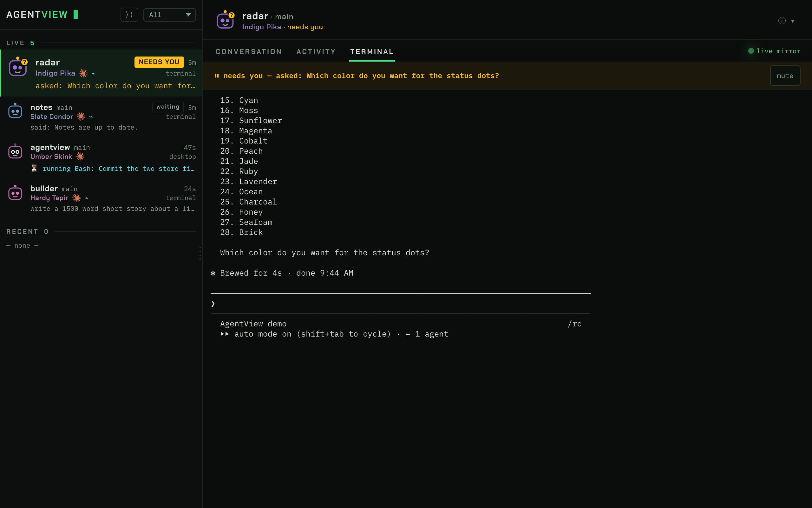

# AgentView

One screen for every AI coding agent on your Mac. See which one needs you, and
answer it from your phone.



AgentView reads the transcripts that Claude Code and Codex write while they
work. Each session gets a name and a face. A session that asks you a question
raises an amber alarm. A session that only finished talking gets a quiet
"waiting" chip. Sessions you start through the `av` wrapper also stream their
terminal to the browser, and you can type back.

## Quick start

Requires Node 20 or later.

1. Clone and install:

   ```bash
   git clone git@github.com:vbudhram/AgentView.git
   cd AgentView
   npm install
   ```

2. Build and start:

   ```bash
   npm run build
   npm start
   ```

3. Open http://127.0.0.1:4400. Sessions from `~/.claude/projects` and
   `~/.codex/sessions` appear with no setup.

## Type into a session

Reading works for every session. To type into one, start it through the
wrapper. The wrapper runs the agent in a pseudo terminal and streams it to the
app. Your terminal works exactly as before.

1. Put `av` on your PATH:

   ```bash
   npm link
   ```

2. Start agents through it:

   ```bash
   av claude
   av codex
   ```

3. Optional. Make it the default:

   ```bash
   echo "alias claude='av claude'" >> ~/.bash_profile
   echo "alias codex='av codex'"  >> ~/.bash_profile
   ```

To wrap a session that already runs, exit it and resume it wrapped:

```bash
av claude --continue
```

A session started without the wrapper is read only. The app shows the reason
and this command.

## Use it from your phone with Tailscale

The server also listens on your Mac's Tailscale address. Only devices on your
tailnet can reach it. Nothing is exposed to your LAN or the internet.

1. Install [Tailscale](https://tailscale.com/download) on the Mac and on the
   phone. Sign in to the same account on both.

2. Find the Mac's Tailscale address. On the Mac:

   ```bash
   tailscale ip -4
   ```

   If `tailscale` is not on your PATH (the App Store build), use the app's
   own binary:

   ```bash
   /Applications/Tailscale.app/Contents/MacOS/Tailscale ip -4
   ```

   The Tailscale menu bar app also shows the address and the machine name.

3. On the phone, open `http://<that address>:4400`. You can also use the
   MagicDNS name, for example `http://my-mac.tail1234.ts.net:4400`.

4. Add it to the home screen for a one-tap open.

The address uses plain `http`. This is safe on a tailnet because WireGuard
already encrypts the connection. HTTPS certificates are not required.

The app has no login. Any device on your tailnet can read your transcripts and
type into wrapped sessions. Keep the tailnet private, or put a token in front
of the app before you share it.

### Limit access with a Tailscale ACL

By default every device on a tailnet can reach every other device. An ACL
limits port 4400 to the devices you choose. Edit the policy at
https://login.tailscale.com/admin/acls:

```json
{
  "acls": [
    {
      "action": "accept",
      "src":    ["my-phone", "my-mac"],
      "dst":    ["my-mac:4400"]
    }
  ]
}
```

Replace the names with your device names from the admin console. With this rule
in place, a new or shared device on the tailnet cannot open the app. Keep
two-factor authentication on the account you sign in to Tailscale with, because
that account can enroll new devices.

Never expose the app with `tailscale funnel`. Funnel publishes the port to the
public internet, and the app has no login.

## Configuration

`AGENTVIEW_IGNORE` is a colon-separated list of path prefixes to hide. The
default hides tool directories (`~/.claude-mem`, `~/.claude`, `~/.codex`) and
temp directories, so plugins that run their own agents do not bury your work.

```bash
AGENTVIEW_IGNORE="$HOME/scratch:$HOME/.claude-mem" npm start
```

## Limits

- Claude Desktop sessions are read only. The desktop app uses a private channel
  that nothing outside it can write to.
- The spinner ticker reads Claude Code's status line. Codex sessions get a
  terminal mirror but no ticker.
- The list shows the last 24 hours.
- A wrapper started before an upgrade keeps the old protocol until you restart
  that session. The app marks it.

## Development

```bash
npm run dev           # dev server; restart it after you change server code
npm test              # vitest
npx tsc --noEmit      # types
```
